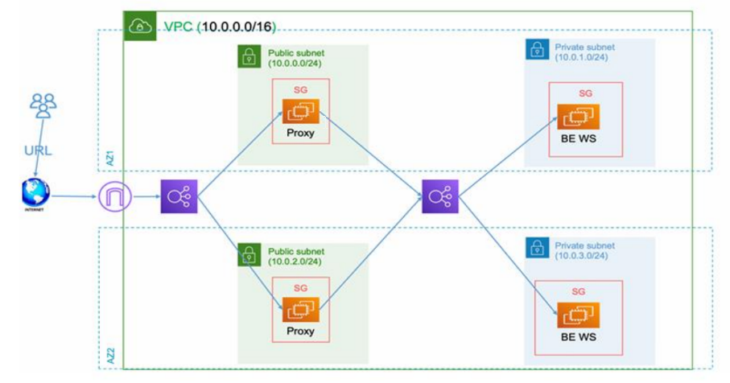
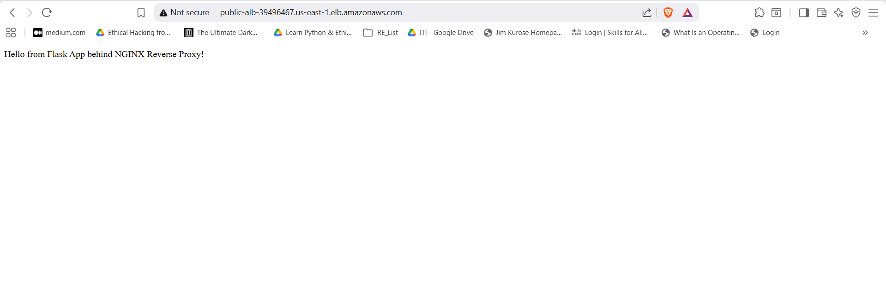

# Secure Web App with Public Proxy + Private Backend on AWS using Terraform

## Overview

This project provisions a scalable, highly available two-tier application architecture on AWS using Terraform. It includes a public NGINX reverse-proxy layer and a private Flask application layer, each fronted by Application Load Balancers and distributed across multiple Availability Zones.

## Architecture

- Public ALB → NGINX reverse-proxy EC2 instances (public subnets)
- Internal ALB → Flask application EC2 instances (private subnets)
- VPC with public and private subnets, Internet Gateway, NAT Gateway
- Security groups restrict inter-tier access and internet exposure

## Architecture Diagram



## Prerequisites

- AWS CLI configured with appropriate credentials
- Terraform v0.12+ (recommended latest stable)
- An SSH key pair available in the target AWS region
- Basic familiarity with Terraform and AWS networking

## Quick Start

1. Clone the repository:

```bash
git clone https://github.com/Kareem-Ataam/ITI-Terraform-Final-Project.git
cd ITI-Terraform-Final-Project
```

2. Configure variables in `terraform.tfvars` (region, CIDR blocks, key pair, etc.).

3. Initialize and apply:

```bash
terraform init
terraform plan
terraform apply
```

4. Confirm resources in the AWS Console or via AWS CLI.

## Project Structure

- modules/
  - alb/ — ALB, target groups, listeners, security groups
  - vpc/ — VPC, subnets, routing, gateways
  - instances/ — EC2 instances, user-data, provisioning
- terraform.tfvars — environment-specific variables (not committed)
- variables.tf — variable definitions
- outputs.tf — useful outputs (ALB DNS, instance IDs, etc.)
- .gitignore — repository ignores
- scripts/ — provisioning scripts (Docker, NGINX setup)
- flask_app/ — sample Flask app and Dockerfile

## Modules

- VPC: builds the network layout (public/private subnets, IGW, NAT).
- ALB: creates public and private Application Load Balancers, target groups, health checks and listeners.
- Instances: provisions EC2 instances, installs Docker, runs NGINX and Flask containers.

## Security Considerations

- Private instances reside in private subnets with no direct internet access.
- Internal ALB only accepts traffic from the reverse-proxy security group.
- Sensitive variables (secrets, keys) should be kept out of VCS (use SSM, Secrets Manager, or encrypted tfstate).
- Consider enabling HTTPS (ACM + ALB) for production.

## Cost Considerations

Resources used may incur non-trivial cost:

- Multiple EC2 instances
- Two ALBs
- NAT Gateway(s)
  Monitor usage and choose appropriate instance sizes for cost control.

## Maintenance

- Keep AMIs and Docker images updated.
- Monitor ALB health checks and CloudWatch metrics.
- Rotate credentials and review security groups periodically.

## Cleanup

To destroy all resources:

```bash
terraform destroy
```

## Applying the config in a newly created workspace:

We will working on a workspace other than the default one:

- Creating a workspace called dev and switching to it:
  

- Then we will be applying the terraform config while we are in this workspace.

## Testing and Verification:

After the infrastructure is provisioned and our application is up and running we can it using the DNS name from the browser:

